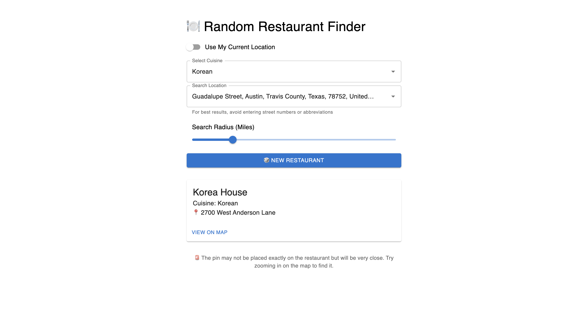
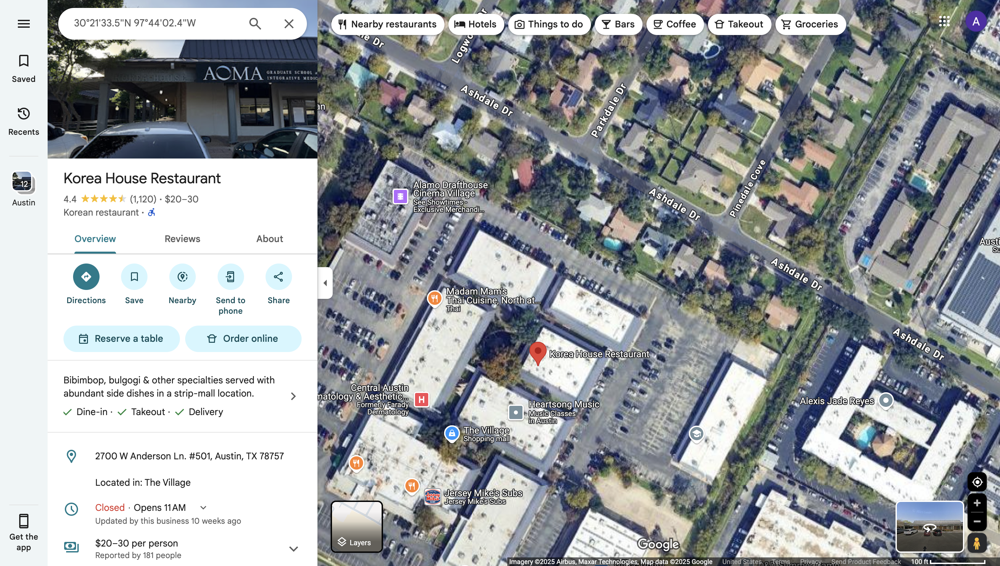
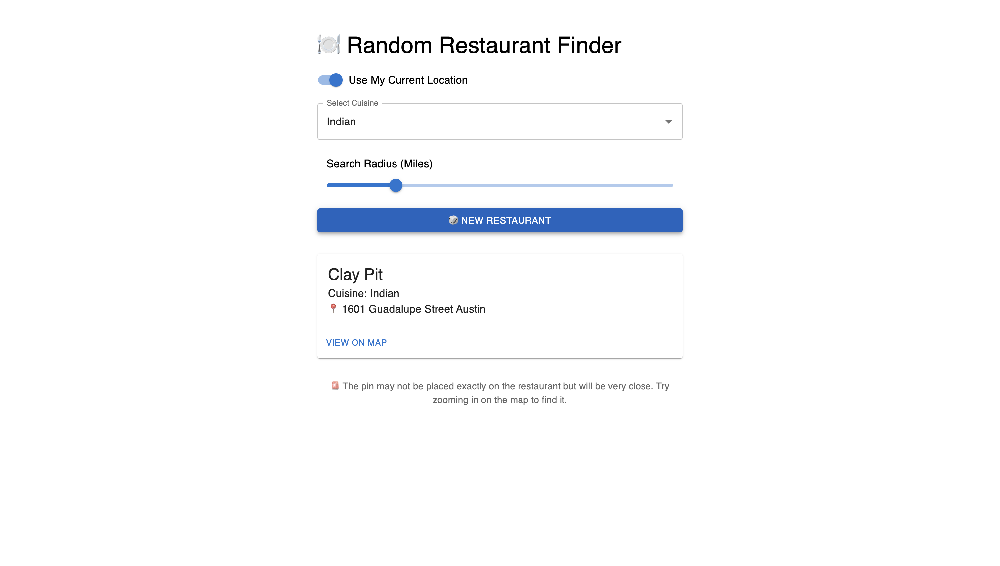

# 🍽️ Random Restaurant Finder

A web app that helps you discover a random restaurant near you based on your location and cuisine preference. Built with **Next.js**, **TypeScript**, and **Material UI**, using **OpenStreetMap APIs** for data.

This project also served as a hands-on introduction to full-stack app deployment using **Vercel** for continuous integration and hosting.

[🔗 Live Site](https://random-restaurant-finder-six.vercel.app)

---

## ✨ Features

- 🎲 Random restaurant suggestions based on your location
- 📍 Option to use your current location or manually search
- 🍱 Supports a variety of cuisines
- 📏 Adjustable search radius (in miles)
- 🗺️ Restaurant location opens directly in Google Maps
- ⚡ Fast and lightweight — no login required

---

## 📸 Screenshots

| Search & Result | Map View |
|-----------------|----------|
|  |  |

| Alternate Cuisine |
|------------------|
|  |

---

## 🛠️ Tech Stack

- **Framework:** Next.js (React)
- **Styling:** Material UI
- **Language:** TypeScript
- **Geolocation & Search:** Nominatim API (OpenStreetMap)
- **Restaurant Query:** Overpass API
- **Hosting:** Vercel
